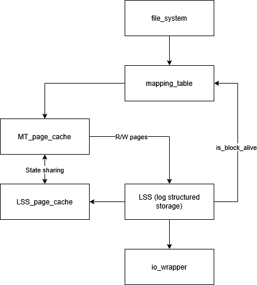

Driver Overview
===============

The driver is composed of three main components:

- **Mapping Table**
- **Mapping Table Page Cache (MTPC)**
- **Log Structured Storage (LSS)**

   Block diagram showing the interactions between Mapping Table, MTPC, and LSS.

This document provides an overview of each component.

Terminology
-----------

- **Page:** The smallest unit of I/O.
- **Block:** The I/O granuality used by the user.
- **Segment:** A collection of blocks; The smallest erasable unit.

Currently the page and block are equivalent and are used interchangeably in this document.

================================================
Mapping Table
================================================

The **Mapping Table** is organized in a hierarchical, static structure.  

At creation time, the total number of logical-to-physical mappings is known, allowing the structure of
the tree to be fully determined in advance, 
and the tree is built lazily — paths are only instantiated when first traversed.

Each parent node tracks the physical locations of its children on storage.
When a child page is rewritten, the parent must be updated to reflect the new location.

The **root** of the mapping table is always kept in memory and only flushed to
storage during specific events — **checkpointing** and **shutdown**.

The mapping table maintains its own **page cache**, which caches mapping table
pages in memory.

To facilitate parent updates, when traversing the tree we **pin** the entire path
in memory.  

This ensures the parent is always accessible when its child is evicted, enabling
easy updates.  

However, this also enforces **bottom-up eviction** — a page cannot be evicted
until all its children have been evicted.  

Currently, this is the only cache that can hold **dirty** entries.

Traversal of the mapping tree is performed by repeatedly refining the logical
address range:

.. code-block:: c

   sub_range = curr_range / fanout;
   target_index = (logical_address % curr_range) / sub_range;

The process continues until ``sub_range == 1``, indicating a leaf node.

To ensure consistent traversal and a fully balanced tree, the total number
of mappings is **padded** accordingly.

================================================
Mapping Table Page Cache (MTPC)
================================================

The **MTPC** manages the mapping table’s pages in memory and the associated
buffer space.

It allocates a dedicated **memory pool** from which all page buffers are drawn.

Entries are managed through two structures:

1. A **linked list** for **LRU tracking**.
2. A **sorted array** (by start range) for efficient **searching**.

The array stores pointers to linked-list entries, and the linked list
serves as a stable location for metadata updates.

The cache can have both a **parent** and a **child**:

- The **parent cache** (mapping table cache) supports **read/write** operations.
  Pages in this cache must have their parents pinned in memory.
- The **child cache** (used by LSS) is **read-only**, so pages do not pin parents.

Parent and child caches share visibility of each other’s entries.  
When a parent cache acquires a page:

- If the page is already in the parent, return it.
- If it’s in the child, **swap ownership** — the parent takes the entry and
  gives the child a free one, avoiding redundant I/O.
- If it’s in neither parent nor child, read from storage.

Because entries have stable addresses, ownership swaps involve minimal data movement.

When the **child cache** acquires a page:

- If the page exists in the child, return it.
- If it exists in the parent, return the parent’s entry, without ownership swapping.
- Otherwise, read from storage.

This ensures that a page exists **only once** in memory, preventing version mismatches.

Each cached page tracks its **start** and **end** ranges along with metadata.
Queries may use a logical address or subrange; the cache returns the **deepest**
page containing that address (i.e., the smallest range match).

Currently, lookup is **O(n)** but can be optimized in future versions.

The cache maintains a **free entry pool** for immediate reuse.

If a requested page is missing and no free slots exist, eviction occurs.
Dirty pages are flushed before eviction.  
The MTPC is also responsible for all **reads and writes** to the **LSS**.

================================================
Log Structured Storage (LSS)
================================================

The **LSS** is an **append-only log-structured storage** system.

Since appending eventually wraps around, the system must **clean tail blocks**
to free space for new writes. Two strategies were considered:

1. Cleaning entire segments at once.
2. Overlapping cleaning with ongoing writes.

The second option — **overlapped cleaning** — was chosen to minimize latency variance
between writes and distribute work over time.

.. todo::
   Investigate the trade-off between overlapped cleaning and full-segment cleaning
   for throughput vs latency variance.

However, overlapping introduces recursive risks, such as:

- ``write -> clean tail -> tail block dead -> move tail -> finish write``

- ``R/W cache starts a write -> clean tail -> tail block is alive -> reallocate to head -> move parent from RO cache to the R/W cache to get updated -> R/W cache is full and requires eviction -> R/W cache starts a write -> clean tail -> ...``

To prevent infinite recursion:

- Only the **first write** in a cycle is allowed to clean the tail.
- Subsequent writes pass a ``clean_tail = false`` flag.

The **parent-child cache design** mitigates recursion further, as the LSS’s
read-only cache never evicts pages.

**Buffered reallocation** is used to minimize update overhead:
instead of updating the parent after every reallocation, each
(old offset, new offset, header) tuple is stored in memory.

When the buffer fills, all pending reallocations are flushed together —
benefiting from spatial locality among related pages.

Blocks are not erased when the tail leaves them, but rather when the **head**
reaches them to write new data.

A minimum threshold of segments must remain between **head** and **tail** to avoid
deadlock conditions where neither can progress due to overlapping segment use.

================================================
Storage Reopening and Recovery
================================================

At the start of each segment, metadata is written — including a **sequence number**
and a flag marking **checkpoint existence**.

To minimize log replay time during reopening, a **checkpoint** is written at
the beginning of each new segment:

- All dirty pages are flushed.
- The checkpoint ends by writing the **root** of the mapping table.

This root represents the complete system state up to that point.
During recovery, the system locates the most recent checkpoint segment,
reads its root, and replays only the log segments written **after** it.

.. note::
   The current implementation assumes graceful shutdowns only.
   Power-failure handling will be added in future versions.

.. note::
   Checkpoints are currently written at the start of each new segment.
   Future versions may support adaptive checkpointing based on I/O volume or time.

================================================
Next Steps
================================================

1. Obtain baseline **performance and footprint** on the **STM32H5** and compare to **LevelX**.
2. Extend recovery to handle **power failures** and improve robustness.
3. Determine the optimal strategy for **concurrency management**.
4. Conduct **code refactoring**, optimization, and cleanup.
5. **Integrate** into **Xinu**.

----
**Revision:** 1.0  
**Last Updated:** Oct 2025  
**Maintainer:** Hesham Youssef  